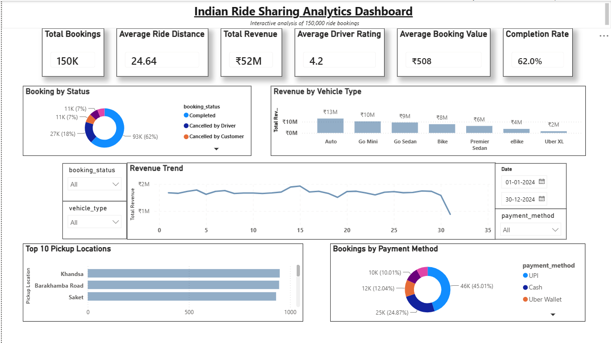

# Indian Ride Sharing Analytics

An end-to-end data analytics project based on ride-sharing booking data. The project looks at booking performance, revenue, cancellations, vehicle types, customer ratings, payment methods, and location-level trends.

The analysis was carried out using Python, MySQL, and Power BI, starting with data cleaning and exploratory analysis and ending with an interactive dashboard.

## Dashboard

<p align="center">
  
</p>

## Project Objective

The main goal of this project was to understand how ride bookings are performing and identify patterns that could be useful for business decisions.

Some of the questions explored in the analysis were:

- How many bookings are completed successfully?
- Which vehicle types generate the most revenue?
- Which pickup locations have the highest number of bookings?
- What are the most commonly used payment methods?
- How does revenue change over time?
- What are the main reasons for ride cancellations?
- How do customer and driver ratings vary?
- How do completed, cancelled, and incomplete rides compare?

## Dataset

The dataset contains approximately **150,000 ride booking records**.

The main fields include:

- Booking Date and Time
- Booking ID
- Customer ID
- Booking Status
- Vehicle Type
- Pickup Location
- Drop Location
- Average VTAT
- Average CTAT
- Booking Value
- Ride Distance
- Driver Rating
- Customer Rating
- Payment Method
- Customer and Driver Cancellation Details
- Incomplete Ride Details

The cleaned dataset is not included in the repository because of its file size.

## Tools Used

- **Python** – data cleaning and exploratory data analysis
- **Pandas** – data manipulation
- **NumPy** – numerical operations
- **Matplotlib** – visualizations
- **MySQL** – SQL analysis and business queries
- **Power BI** – interactive dashboard
- **Excel** – initial data handling

## Project Workflow

### 1. Data Cleaning

The raw dataset was cleaned using Python and Pandas.

The cleaning process included:

- Checking missing values
- Removing duplicate records
- Converting columns to appropriate data types
- Cleaning text and ID fields
- Handling missing numerical values
- Standardizing column names
- Creating additional fields required for analysis

The cleaned data was then used for the SQL analysis and Power BI dashboard.

### 2. Exploratory Data Analysis

Exploratory analysis was performed to understand booking patterns and identify important trends.

The analysis covered:

- Booking status distribution
- Revenue by vehicle type
- Ride distance
- Booking value
- Customer and driver ratings
- Payment methods
- Pickup and drop locations
- Revenue trends
- Cancellation patterns
- Day-wise booking trends

The Python notebook and EDA visualizations are available in the `python` folder.

### 3. SQL Analysis

The cleaned data was imported into MySQL for further analysis.

A set of **30 SQL queries** was created to answer different business questions involving:

- Booking performance
- Revenue
- Vehicle types
- Payment methods
- Cancellations
- Customer and driver ratings
- Location analysis
- Ranking
- Aggregations
- Common Table Expressions
- Window functions

The SQL queries are available in:

`SQL/ride_analytics_queries.sql`

### 4. Power BI Dashboard

The final analysis was presented through an interactive Power BI dashboard.

The dashboard includes:

- Total Bookings
- Average Ride Distance
- Total Revenue
- Average Driver Rating
- Average Booking Value
- Completion Rate
- Booking Status Distribution
- Revenue by Vehicle Type
- Revenue Trend
- Top Pickup Locations
- Payment Method Distribution
- Date, Vehicle Type, Booking Status and Payment Method filters

The Power BI file is available in:

`Power BI/Ride_Analytics.pbix`

## Key Findings

Some of the main observations from the analysis were:

- Around **150,000 bookings** are present in the dataset.
- Completed rides account for approximately **62% of total bookings**.
- Total revenue is approximately **₹52 million**.
- The average ride distance is around **24.64 km**.
- The average driver rating is approximately **4.2**.
- The average booking value is around **₹508**.
- Auto and Go Mini contribute a significant share of overall revenue.
- A relatively small group of pickup locations accounts for a large number of bookings.
- UPI and other digital payment methods make up a substantial portion of payments.

These findings were used to build the final Power BI dashboard and support the business analysis.

## Project Structure

```text
indian-ride-sharing-analytics/
│
├── Dashboard/
│   └── dashboard.png
│
├── Power BI/
│   └── Ride_Analytics.pbix
│
├── SQL/
│   └── ride_analytics_queries.sql
│
├── python/
│   ├── ride_analytics.ipynb
│   └── EDA Charts/
│       ├── EDA charts
│       └── ...
│
└── README.md
